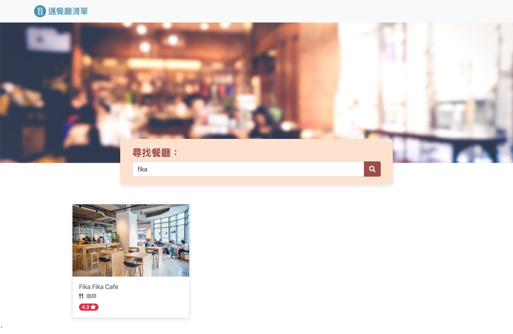

# My Restaurant List 
邁餐聽清單-讓使用者瀏覽或搜尋餐廳資訊

# Installing
在終端機輸入下列指令：

`$git clone git@github.com:leeyichien/restaurant_list.git`

`$cd restaurant_list`

`$npm install`

`$npm run dev`

你可以開啟專案[localhost:3000](http://localhost:3000)

# 畫面

## 首頁-瀏覽所有的餐廳

## 搜尋功能

## 餐廳內容資訊頁面

